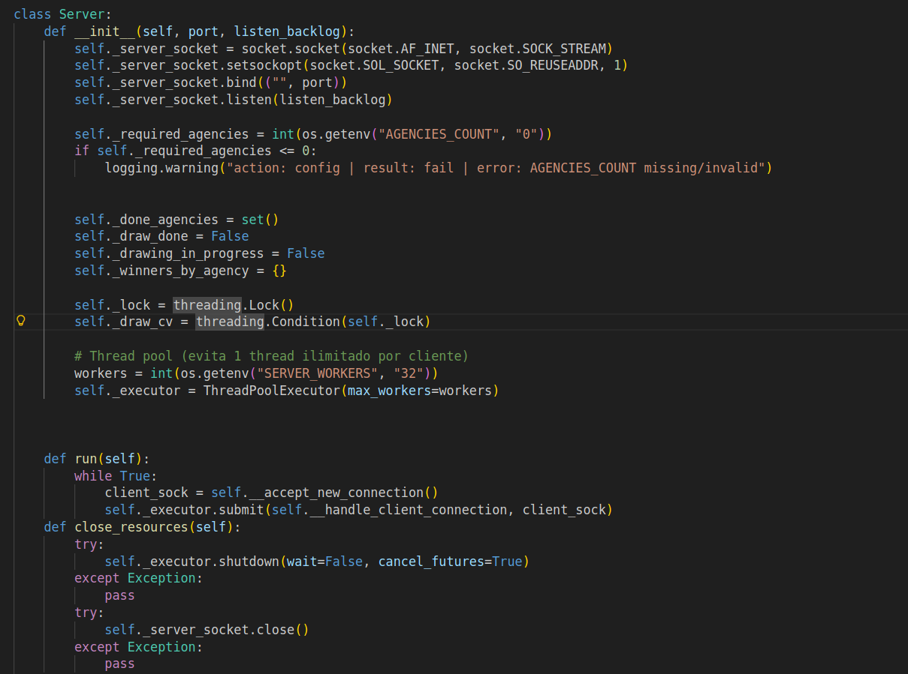
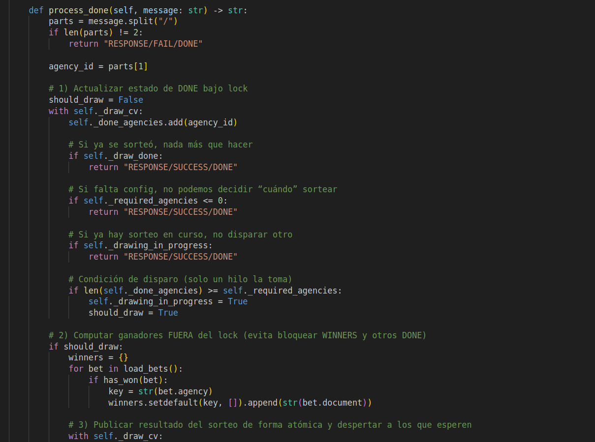
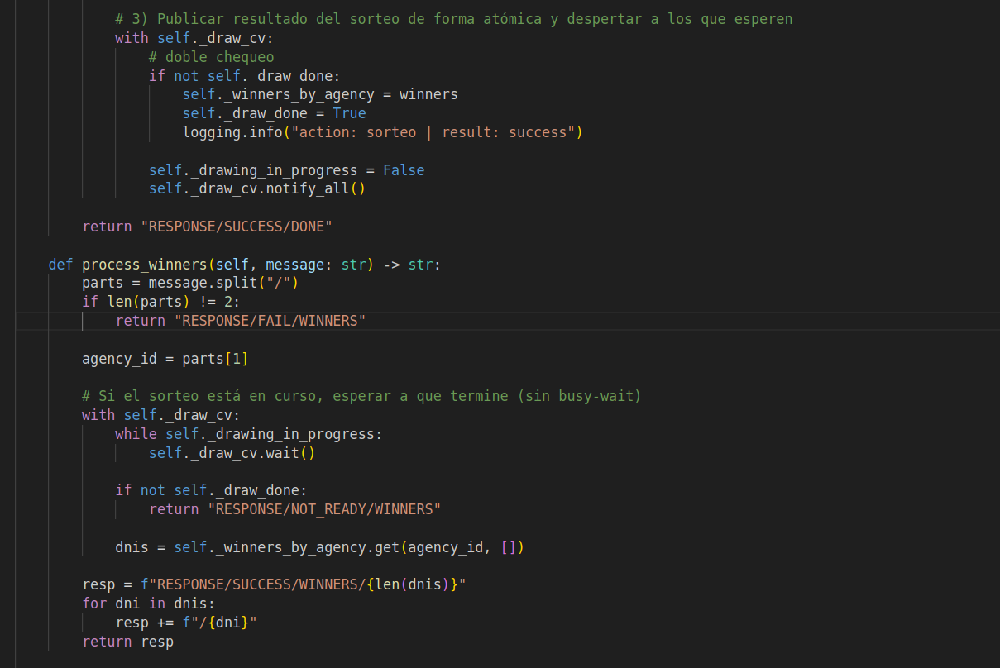

# TP0: Docker + Comunicaciones + Concurrencia

En el presente repositorio se provee un esqueleto básico de cliente/servidor, en donde todas las dependencias del mismo se encuentran encapsuladas en containers. Los alumnos deberán resolver una guía de ejercicios incrementales, teniendo en cuenta las condiciones de entrega descritas al final de este enunciado.

 El cliente (Golang) y el servidor (Python) fueron desarrollados en diferentes lenguajes simplemente para mostrar cómo dos lenguajes de programación pueden convivir en el mismo proyecto con la ayuda de containers, en este caso utilizando [Docker Compose](https://docs.docker.com/compose/).

## Instrucciones de uso
El repositorio cuenta con un **Makefile** que incluye distintos comandos en forma de targets. Los targets se ejecutan mediante la invocación de:  **make \<target\>**. Los target imprescindibles para iniciar y detener el sistema son **docker-compose-up** y **docker-compose-down**, siendo los restantes targets de utilidad para el proceso de depuración.

Los targets disponibles son:

| target  | accion  |
|---|---|
|  `docker-compose-up`  | Inicializa el ambiente de desarrollo. Construye las imágenes del cliente y el servidor, inicializa los recursos a utilizar (volúmenes, redes, etc) e inicia los propios containers. |
| `docker-compose-down`  | Ejecuta `docker-compose stop` para detener los containers asociados al compose y luego  `docker-compose down` para destruir todos los recursos asociados al proyecto que fueron inicializados. Se recomienda ejecutar este comando al finalizar cada ejecución para evitar que el disco de la máquina host se llene de versiones de desarrollo y recursos sin liberar. |
|  `docker-compose-logs` | Permite ver los logs actuales del proyecto. Acompañar con `grep` para lograr ver mensajes de una aplicación específica dentro del compose. |
| `docker-image`  | Construye las imágenes a ser utilizadas tanto en el servidor como en el cliente. Este target es utilizado por **docker-compose-up**, por lo cual se lo puede utilizar para probar nuevos cambios en las imágenes antes de arrancar el proyecto. |
| `build` | Compila la aplicación cliente para ejecución en el _host_ en lugar de en Docker. De este modo la compilación es mucho más veloz, pero requiere contar con todo el entorno de Golang y Python instalados en la máquina _host_. |

### Servidor

Se trata de un "echo server", en donde los mensajes recibidos por el cliente se responden inmediatamente y sin alterar. 

Se ejecutan en bucle las siguientes etapas:

1. Servidor acepta una nueva conexión.
2. Servidor recibe mensaje del cliente y procede a responder el mismo.
3. Servidor desconecta al cliente.
4. Servidor retorna al paso 1.

### Cliente
 se conecta reiteradas veces al servidor y envía mensajes de la siguiente forma:
 
1. Cliente se conecta al servidor.
2. Cliente genera mensaje incremental.
3. Cliente envía mensaje al servidor y espera mensaje de respuesta.
4. Servidor responde al mensaje.
5. Servidor desconecta al cliente.
6. Cliente verifica si aún debe enviar un mensaje y si es así, vuelve al paso 2.

## Parte 3: Repaso de Concurrencia
En este ejercicio es importante considerar los mecanismos de sincronización a utilizar para el correcto funcionamiento de la persistencia.

### Ejercicio N°8:

Modificar el servidor para que permita aceptar conexiones y procesar mensajes en paralelo. En caso de que el alumno implemente el servidor en Python utilizando _multithreading_,  deberán tenerse en cuenta las [limitaciones propias del lenguaje](https://wiki.python.org/moin/GlobalInterpreterLock).

### Resolución - Ejercicio N°8 (concurrencia)

Para cumplir con el enunciado del Ejercicio 8, se realizaron los siguientes cambios en esta branch respecto al ejercicio anterior (servidor secuencial):

---

#### Cambios realizados en el código

- **Aceptación concurrente de conexiones:**
  - El servidor ahora utiliza un `ThreadPoolExecutor` (de `concurrent.futures`) para procesar múltiples conexiones de clientes en paralelo.
  - Cada vez que se acepta una nueva conexión, se delega el manejo de esa conexión a un thread del pool.
  - **Dónde:**  
    - En `server/common/server.py`, método `run()`:
    - El `ThreadPoolExecutor` se inicializa en el constructor (`__init__`) del servidor.
    

- **Sincronización del estado compartido:**
  - Se agregaron locks (`threading.Lock` y `threading.Condition`) para proteger el acceso y modificación de variables compartidas entre threads, como:
    - El set de agencias que notificaron DONE.
    - El flag que indica si el sorteo ya fue realizado.
    - El diccionario de ganadores.
  - **Dónde:**  
    - En `server/common/server.py`, atributos como `self._lock`, `self._draw_cv` y su uso en métodos como `process_done` y `process_winners`.
    
    

- **Evitar condiciones de carrera y deadlocks:**
  - El sorteo solo se ejecuta una vez, protegido por un lock y un flag.
  - Los threads que consultan ganadores esperan (con `Condition.wait()`) hasta que el sorteo esté listo, evitando busy-wait y garantizando atomicidad.

---

#### Limitaciones del lenguaje Python (multithreading) y cómo se manejan

- **Global Interpreter Lock (GIL):**
  - En Python (CPython), el GIL impide que más de un thread ejecute bytecode Python al mismo tiempo.
  - Esto significa que el multithreading **no mejora el rendimiento en tareas CPU-bound**, pero sí es útil para tareas I/O-bound (como servidores de red).
  - En este ejercicio, el uso de threads es adecuado porque la mayor parte del tiempo los threads están esperando I/O (red, archivos).

- **Condiciones de carrera:**
  - El acceso a variables compartidas debe protegerse con locks para evitar inconsistencias.
  - Se usaron `threading.Lock` y `threading.Condition` para garantizar la correcta sincronización.

- **Deadlocks:**
  - Se evitó mantener locks durante operaciones de I/O o procesamiento pesado.
  - El lock solo se mantiene durante la actualización de estado compartido, y se libera antes de realizar el sorteo o responder a los clientes.

---

**En resumen:**  
El servidor pasó de un modelo secuencial a uno concurrente usando multithreading, con un pool de threads y mecanismos de sincronización para proteger el estado compartido. Se tuvieron en cuenta las limitaciones del GIL y se diseñó el acceso a los recursos compartidos para evitar condiciones de carrera y deadlocks.

