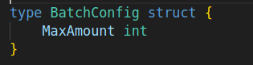
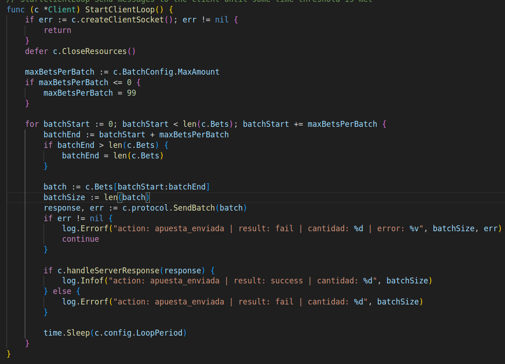
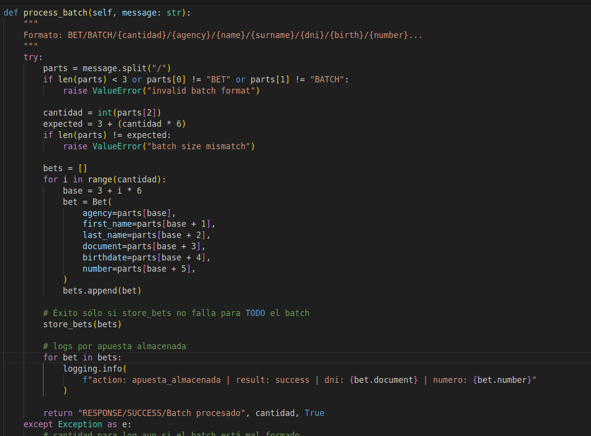
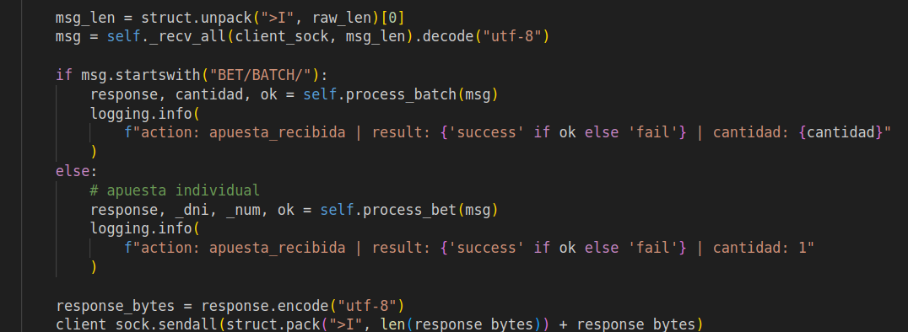
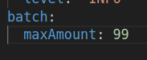

# TP0: Docker + Comunicaciones + Concurrencia

En el presente repositorio se provee un esqueleto básico de cliente/servidor, en donde todas las dependencias del mismo se encuentran encapsuladas en containers. Los alumnos deberán resolver una guía de ejercicios incrementales, teniendo en cuenta las condiciones de entrega descritas al final de este enunciado.

 El cliente (Golang) y el servidor (Python) fueron desarrollados en diferentes lenguajes simplemente para mostrar cómo dos lenguajes de programación pueden convivir en el mismo proyecto con la ayuda de containers, en este caso utilizando [Docker Compose](https://docs.docker.com/compose/).

## Instrucciones de uso
El repositorio cuenta con un **Makefile** que incluye distintos comandos en forma de targets. Los targets se ejecutan mediante la invocación de:  **make \<target\>**. Los target imprescindibles para iniciar y detener el sistema son **docker-compose-up** y **docker-compose-down**, siendo los restantes targets de utilidad para el proceso de depuración.

Los targets disponibles son:

| target  | accion  |
|---|---|
|  `docker-compose-up`  | Inicializa el ambiente de desarrollo. Construye las imágenes del cliente y el servidor, inicializa los recursos a utilizar (volúmenes, redes, etc) e inicia los propios containers. |
| `docker-compose-down`  | Ejecuta `docker-compose stop` para detener los containers asociados al compose y luego  `docker-compose down` para destruir todos los recursos asociados al proyecto que fueron inicializados. Se recomienda ejecutar este comando al finalizar cada ejecución para evitar que el disco de la máquina host se llene de versiones de desarrollo y recursos sin liberar. |
|  `docker-compose-logs` | Permite ver los logs actuales del proyecto. Acompañar con `grep` para lograr ver mensajes de una aplicación específica dentro del compose. |
| `docker-image`  | Construye las imágenes a ser utilizadas tanto en el servidor como en el cliente. Este target es utilizado por **docker-compose-up**, por lo cual se lo puede utilizar para probar nuevos cambios en las imágenes antes de arrancar el proyecto. |
| `build` | Compila la aplicación cliente para ejecución en el _host_ en lugar de en Docker. De este modo la compilación es mucho más veloz, pero requiere contar con todo el entorno de Golang y Python instalados en la máquina _host_. |

### Servidor

Se trata de un "echo server", en donde los mensajes recibidos por el cliente se responden inmediatamente y sin alterar. 

Se ejecutan en bucle las siguientes etapas:

1. Servidor acepta una nueva conexión.
2. Servidor recibe mensaje del cliente y procede a responder el mismo.
3. Servidor desconecta al cliente.
4. Servidor retorna al paso 1.

### Cliente
 se conecta reiteradas veces al servidor y envía mensajes de la siguiente forma:
 
1. Cliente se conecta al servidor.
2. Cliente genera mensaje incremental.
3. Cliente envía mensaje al servidor y espera mensaje de respuesta.
4. Servidor responde al mensaje.
5. Servidor desconecta al cliente.
6. Cliente verifica si aún debe enviar un mensaje y si es así, vuelve al paso 2.

### Ejercicio N°6:
Modificar los clientes para que envíen varias apuestas a la vez (modalidad conocida como procesamiento por _chunks_ o _batchs_). 
Los _batchs_ permiten que el cliente registre varias apuestas en una misma consulta, acortando tiempos de transmisión y procesamiento.

La información de cada agencia será simulada por la ingesta de su archivo numerado correspondiente, provisto por la cátedra dentro de `.data/datasets.zip`.
Los archivos deberán ser inyectados en los containers correspondientes y persistido por fuera de la imagen (hint: `docker volumes`), manteniendo la convencion de que el cliente N utilizara el archivo de apuestas `.data/agency-{N}.csv` .

En el servidor, si todas las apuestas del *batch* fueron procesadas correctamente, imprimir por log: `action: apuesta_recibida | result: success | cantidad: ${CANTIDAD_DE_APUESTAS}`. En caso de detectar un error con alguna de las apuestas, debe responder con un código de error a elección e imprimir: `action: apuesta_recibida | result: fail | cantidad: ${CANTIDAD_DE_APUESTAS}`.

La cantidad máxima de apuestas dentro de cada _batch_ debe ser configurable desde config.yaml. Respetar la clave `batch: maxAmount`, pero modificar el valor por defecto de modo tal que los paquetes no excedan los 8kB. 

Por su parte, el servidor deberá responder con éxito solamente si todas las apuestas del _batch_ fueron procesadas correctamente.

### Resolucion - Ejercicio N°6 (batches)
En esta branch se realizaron los siguientes cambios para cumplir con el enunciado del Ejercicio 6, que introduce el procesamiento de apuestas en modalidad **batch** (por chunks):

#### 1. Estructuras y lógica de batch

- **Cliente:**  
  - Se agregó una estructura para representar un batch de apuestas (`[]BatchConfig` en Go).
  
  - El cliente ahora lee todas las apuestas desde el archivo `.data/agency-{N}.csv` (inyectado como volumen) y las agrupa en batches de tamaño configurable.
  
  
  
 

- **Servidor:**  
  - Se agregó lógica para recibir, deserializar y procesar batches completos de apuestas.
  - El servidor procesa todas las apuestas del batch y responde con éxito solo si todas fueron almacenadas correctamente.
  - Si alguna apuesta falla, responde con error y loguea el resultado.
      
     

---
#### 2. Protocolo

 
  - Se extendió el protocolo para soportar mensajes tipo `BET/BATCH/{cantidad}/{apuesta1}/.../{apuestaN}`.
  - El framing y la serialización siguen usando el prefijo de longitud para evitar short-read/write.
    - Cliente:  
      
    - Servidor:
       
    
- **Configuración:**  
  El tamaño máximo de batch ahora es configurable y se valida para no superar los 8kB.

    

- **Volúmenes:**  
  - Los archivos de apuestas `.data/agency-{N}.csv` se montan como volúmenes en cada contenedor cliente, permitiendo la ingesta dinámica de datos sin reconstruir la imagen.

---

#### 3. Impacto en el sistema

- **Eficiencia:**  
  - El envío de apuestas en batch reduce la cantidad de mensajes y mejora la eficiencia de la transmisión y el procesamiento.
- **Atomicidad:**  
  - El servidor garantiza que solo responde con éxito si **todas** las apuestas del batch fueron procesadas correctamente.
- **Flexibilidad:**  
  - El sistema ahora soporta tanto apuestas individuales como en batch, y el tamaño del batch es configurable.

---

