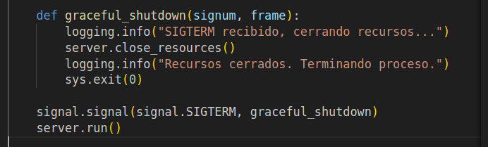
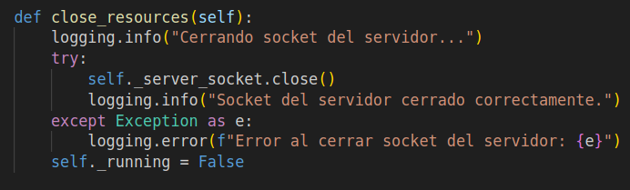
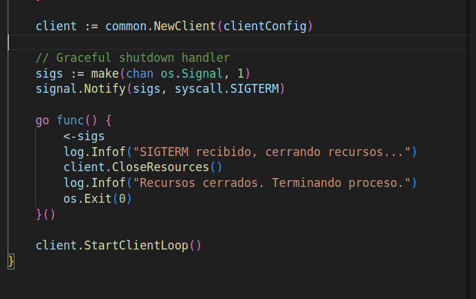
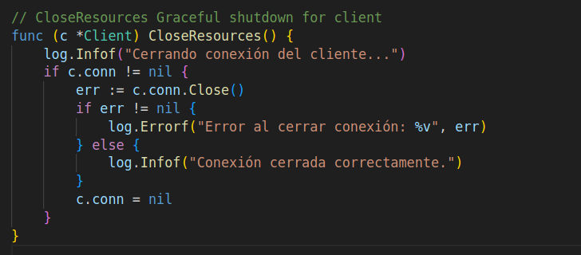

# TP0: Docker + Comunicaciones + Concurrencia

En el presente repositorio se provee un esqueleto básico de cliente/servidor, en donde todas las dependencias del mismo se encuentran encapsuladas en containers. Los alumnos deberán resolver una guía de ejercicios incrementales, teniendo en cuenta las condiciones de entrega descritas al final de este enunciado.

 El cliente (Golang) y el servidor (Python) fueron desarrollados en diferentes lenguajes simplemente para mostrar cómo dos lenguajes de programación pueden convivir en el mismo proyecto con la ayuda de containers, en este caso utilizando [Docker Compose](https://docs.docker.com/compose/).

## Instrucciones de uso
El repositorio cuenta con un **Makefile** que incluye distintos comandos en forma de targets. Los targets se ejecutan mediante la invocación de:  **make \<target\>**. Los target imprescindibles para iniciar y detener el sistema son **docker-compose-up** y **docker-compose-down**, siendo los restantes targets de utilidad para el proceso de depuración.

Los targets disponibles son:

| target  | accion  |
|---|---|
|  `docker-compose-up`  | Inicializa el ambiente de desarrollo. Construye las imágenes del cliente y el servidor, inicializa los recursos a utilizar (volúmenes, redes, etc) e inicia los propios containers. |
| `docker-compose-down`  | Ejecuta `docker-compose stop` para detener los containers asociados al compose y luego  `docker-compose down` para destruir todos los recursos asociados al proyecto que fueron inicializados. Se recomienda ejecutar este comando al finalizar cada ejecución para evitar que el disco de la máquina host se llene de versiones de desarrollo y recursos sin liberar. |
|  `docker-compose-logs` | Permite ver los logs actuales del proyecto. Acompañar con `grep` para lograr ver mensajes de una aplicación específica dentro del compose. |
| `docker-image`  | Construye las imágenes a ser utilizadas tanto en el servidor como en el cliente. Este target es utilizado por **docker-compose-up**, por lo cual se lo puede utilizar para probar nuevos cambios en las imágenes antes de arrancar el proyecto. |
| `build` | Compila la aplicación cliente para ejecución en el _host_ en lugar de en Docker. De este modo la compilación es mucho más veloz, pero requiere contar con todo el entorno de Golang y Python instalados en la máquina _host_. |

### Servidor

Se trata de un "echo server", en donde los mensajes recibidos por el cliente se responden inmediatamente y sin alterar. 

Se ejecutan en bucle las siguientes etapas:

1. Servidor acepta una nueva conexión.
2. Servidor recibe mensaje del cliente y procede a responder el mismo.
3. Servidor desconecta al cliente.
4. Servidor retorna al paso 1.

### Cliente
 se conecta reiteradas veces al servidor y envía mensajes de la siguiente forma:
 
1. Cliente se conecta al servidor.
2. Cliente genera mensaje incremental.
3. Cliente envía mensaje al servidor y espera mensaje de respuesta.
4. Servidor responde al mensaje.
5. Servidor desconecta al cliente.
6. Cliente verifica si aún debe enviar un mensaje y si es así, vuelve al paso 2.

### Ejercicio N°4:
Modificar servidor y cliente para que ambos sistemas terminen de forma _graceful_ al recibir la signal SIGTERM. Terminar la aplicación de forma _graceful_ implica que todos los _file descriptors_ (entre los que se encuentran archivos, sockets, threads y procesos) deben cerrarse correctamente antes que el thread de la aplicación principal muera. Loguear mensajes en el cierre de cada recurso (hint: Verificar que hace el flag `-t` utilizado en el comando `docker compose down`).

### Resolucion - Ejercicio N°4 (Graceful Shutdown)

### Servidor (server.py y main.py)

**Manejo de SIGTERM:**
- En `main.py`, se registra un handler para la señal SIGTERM mediante `signal.signal(signal.SIGTERM, graceful_shutdown)`
- Al recibir SIGTERM (por ejemplo, con `docker compose down -t ...`), se ejecuta `graceful_shutdown`, que:
    - Invoca `server.close_resources()` para cerrar el socket del servidor
    - Loguea el cierre de recursos y finaliza el proceso de forma controlada

**Cierre de recursos:**
- El método `close_resources()` de la clase `Server` cierra el socket y loguea tanto el intento como el resultado (éxito o error)

### Cliente (main.go y client.go)

**Manejo de SIGTERM:**
- En `main.go`, se registra un handler para SIGTERM usando el paquete `os/signal`
- Al recibir SIGTERM, el handler:
    - Invoca `client.CloseResources()` para cerrar la conexión si está abierta
    - Loguea el cierre de recursos y finaliza el proceso de forma controlada

**Cierre de recursos:**
- El método `CloseResources()` de la clase `Client` verifica si la conexión está abierta, la cierra y loguea el resultado

### Flag `-t` en docker compose down

El flag `-t` (o `--timeout`) especifica cuántos segundos Docker espera después de enviar SIGTERM a los contenedores antes de forzar el cierre con SIGKILL. Esto permite que la aplicación realice un cierre graceful: liberar recursos, cerrar sockets, guardar estado, etc.

Ejemplo: `docker compose down -t 10` envía SIGTERM y espera hasta 10 segundos antes de terminar forzadamente si el proceso no finalizó.

