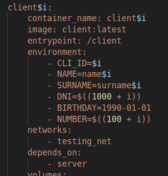
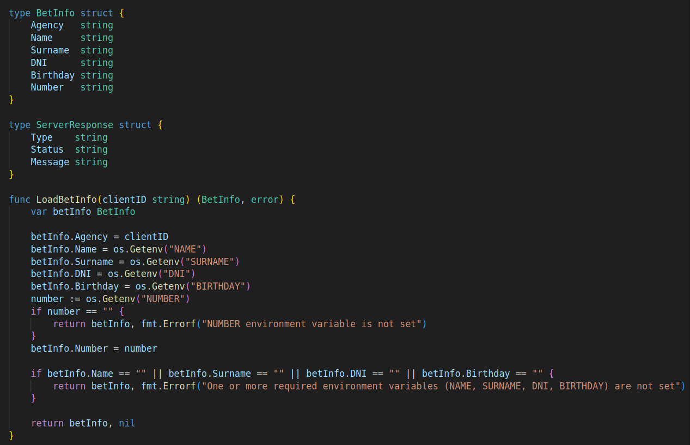
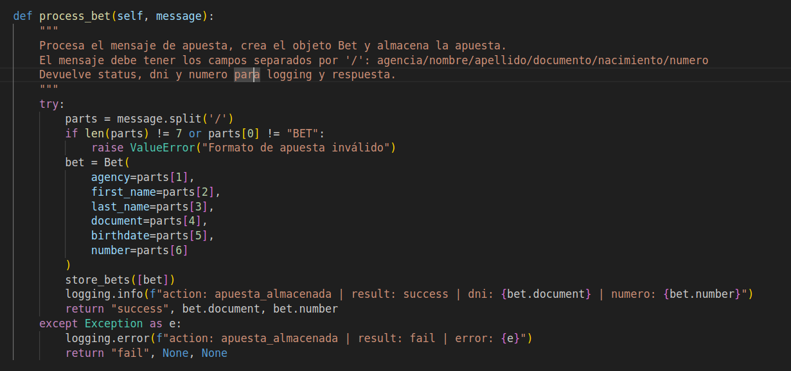
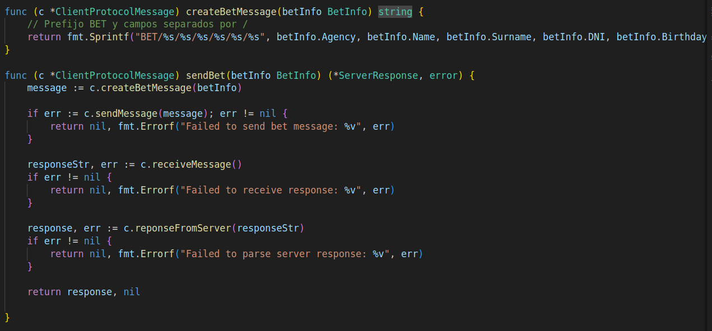
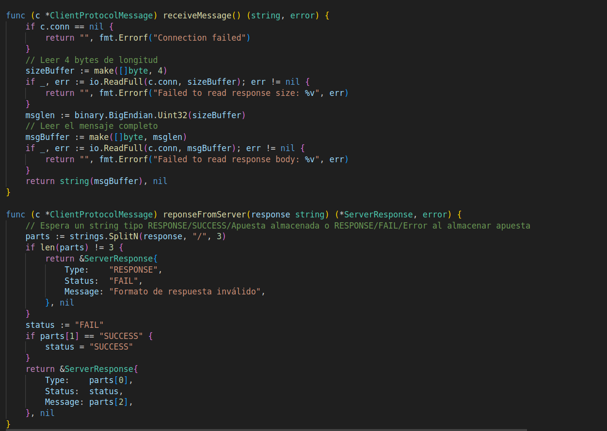
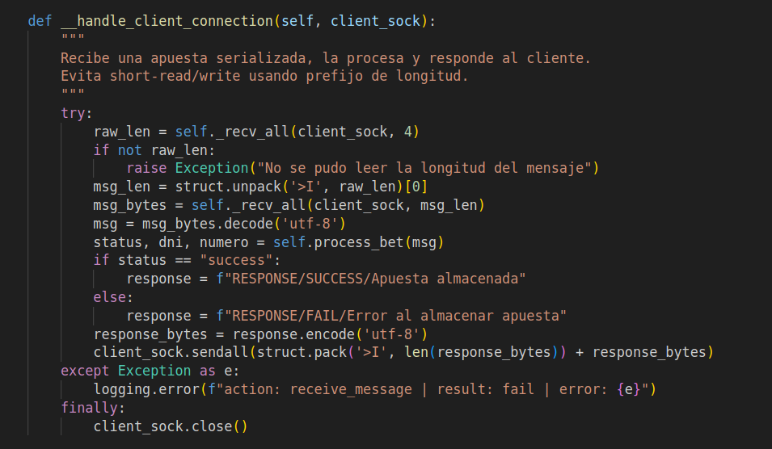
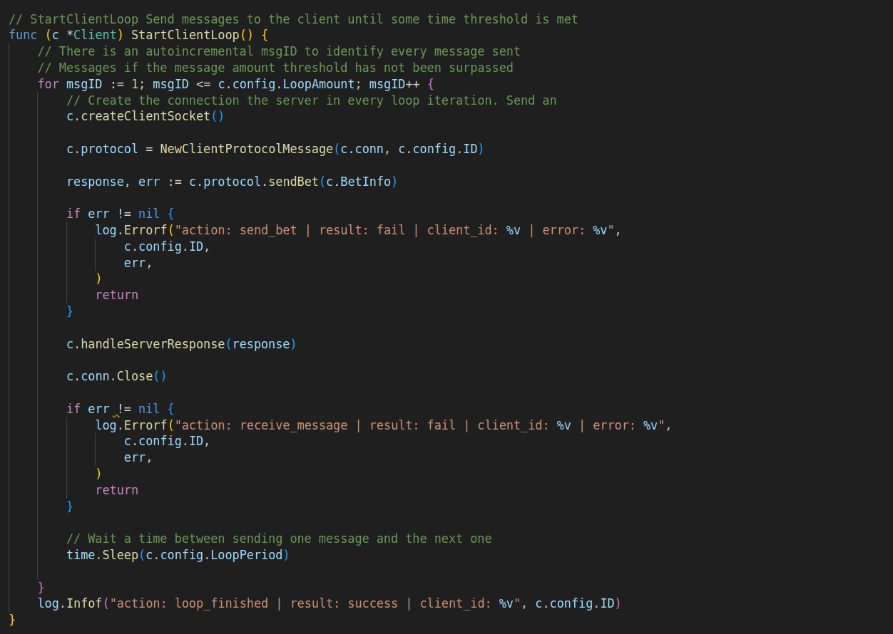
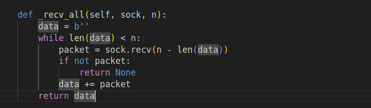
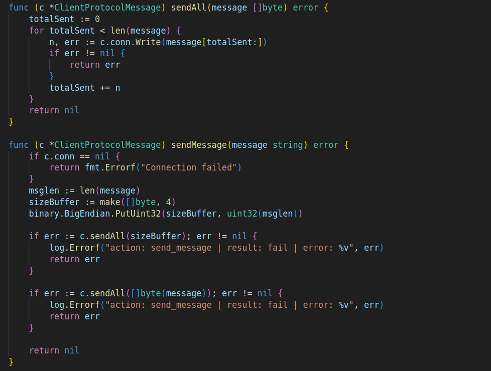

# TP0: Docker + Comunicaciones + Concurrencia

En el presente repositorio se provee un esqueleto básico de cliente/servidor, en donde todas las dependencias del mismo se encuentran encapsuladas en containers. Los alumnos deberán resolver una guía de ejercicios incrementales, teniendo en cuenta las condiciones de entrega descritas al final de este enunciado.

 El cliente (Golang) y el servidor (Python) fueron desarrollados en diferentes lenguajes simplemente para mostrar cómo dos lenguajes de programación pueden convivir en el mismo proyecto con la ayuda de containers, en este caso utilizando [Docker Compose](https://docs.docker.com/compose/).

## Instrucciones de uso
El repositorio cuenta con un **Makefile** que incluye distintos comandos en forma de targets. Los targets se ejecutan mediante la invocación de:  **make \<target\>**. Los target imprescindibles para iniciar y detener el sistema son **docker-compose-up** y **docker-compose-down**, siendo los restantes targets de utilidad para el proceso de depuración.

Los targets disponibles son:

| target  | accion  |
|---|---|
|  `docker-compose-up`  | Inicializa el ambiente de desarrollo. Construye las imágenes del cliente y el servidor, inicializa los recursos a utilizar (volúmenes, redes, etc) e inicia los propios containers. |
| `docker-compose-down`  | Ejecuta `docker-compose stop` para detener los containers asociados al compose y luego  `docker-compose down` para destruir todos los recursos asociados al proyecto que fueron inicializados. Se recomienda ejecutar este comando al finalizar cada ejecución para evitar que el disco de la máquina host se llene de versiones de desarrollo y recursos sin liberar. |
|  `docker-compose-logs` | Permite ver los logs actuales del proyecto. Acompañar con `grep` para lograr ver mensajes de una aplicación específica dentro del compose. |
| `docker-image`  | Construye las imágenes a ser utilizadas tanto en el servidor como en el cliente. Este target es utilizado por **docker-compose-up**, por lo cual se lo puede utilizar para probar nuevos cambios en las imágenes antes de arrancar el proyecto. |
| `build` | Compila la aplicación cliente para ejecución en el _host_ en lugar de en Docker. De este modo la compilación es mucho más veloz, pero requiere contar con todo el entorno de Golang y Python instalados en la máquina _host_. |

### Servidor

Se trata de un "echo server", en donde los mensajes recibidos por el cliente se responden inmediatamente y sin alterar. 

Se ejecutan en bucle las siguientes etapas:

1. Servidor acepta una nueva conexión.
2. Servidor recibe mensaje del cliente y procede a responder el mismo.
3. Servidor desconecta al cliente.
4. Servidor retorna al paso 1.


### Cliente
 se conecta reiteradas veces al servidor y envía mensajes de la siguiente forma:
 
1. Cliente se conecta al servidor.
2. Cliente genera mensaje incremental.
3. Cliente envía mensaje al servidor y espera mensaje de respuesta.
4. Servidor responde al mensaje.
5. Servidor desconecta al cliente.
6. Cliente verifica si aún debe enviar un mensaje y si es así, vuelve al paso 2.


## Parte 2: Repaso de Comunicaciones

Las secciones de repaso del trabajo práctico plantean un caso de uso denominado **Lotería Nacional**. Para la resolución de las mismas deberá utilizarse como base el código fuente provisto en la primera parte, con las modificaciones agregadas en el ejercicio 4.

### Ejercicio N°5:
Modificar la lógica de negocio tanto de los clientes como del servidor para nuestro nuevo caso de uso.

#### Cliente
Emulará a una _agencia de quiniela_ que participa del proyecto. Existen 5 agencias. Deberán recibir como variables de entorno los campos que representan la apuesta de una persona: nombre, apellido, DNI, nacimiento, numero apostado (en adelante 'número'). Ej.: `NOMBRE=Santiago Lionel`, `APELLIDO=Lorca`, `DOCUMENTO=30904465`, `NACIMIENTO=1999-03-17` y `NUMERO=7574` respectivamente.

Los campos deben enviarse al servidor para dejar registro de la apuesta. Al recibir la confirmación del servidor se debe imprimir por log: `action: apuesta_enviada | result: success | dni: ${DNI} | numero: ${NUMERO}`.


#### Servidor
Emulará a la _central de Lotería Nacional_. Deberá recibir los campos de la cada apuesta desde los clientes y almacenar la información mediante la función `store_bet(...)` para control futuro de ganadores. La función `store_bet(...)` es provista por la cátedra y no podrá ser modificada por el alumno.
Al persistir se debe imprimir por log: `action: apuesta_almacenada | result: success | dni: ${DNI} | numero: ${NUMERO}`.

#### Comunicación:
Se deberá implementar un módulo de comunicación entre el cliente y el servidor donde se maneje el envío y la recepción de los paquetes, el cual se espera que contemple:
* Definición de un protocolo para el envío de los mensajes.
* Serialización de los datos.
* Correcta separación de responsabilidades entre modelo de dominio y capa de comunicación.
* Correcto empleo de sockets, incluyendo manejo de errores y evitando los fenómenos conocidos como [_short read y short write_](https://cs61.seas.harvard.edu/site/2018/FileDescriptors/).


### Resolucion - Ejercicio N°5 (protocolo)
 
A continuación se resumen los cambios realizados, la definición del protocolo, la separación de responsabilidades y el manejo robusto de la comunicación.

---

### 1. Cliente: envío de apuestas como agencia

Primero, el cliente toma los datos de la apuesta (nombre, apellido, DNI, nacimiento, número) desde **variables de entorno**.



Luego, estos datos se empaquetan en una estructura de dominio (`BetInfo`) y se serializan para ser enviados al servidor. Esta informacion se carga mediante `LoadBetInfo` en el archivo `model.go`.



Aqui tambine se encuentra el struct `ServerResponse`, para manejar la respuesta del servidor.


 Al recibir confirmación, el cliente loguea:
  ```
  action: apuesta_enviada | result: success | dni: ${DNI} | numero: ${NUMERO}
  ```


---

### 2. Servidor: recepción y almacenamiento de apuestas

El servidor recibe los mensajes, los deserializa y almacena la apuesta usando la función provista `store_bets(...)`.





 Al persistir la apuesta, loguea:
  ```
  action: apuesta_almacenada | result: success | dni: ${DNI} | numero: ${NUMERO}
  ```


---

#### 3. Protocolo de comunicación

- **Formato del mensaje:**  
  ```
  BET/{agencia}/{nombre}/{apellido}/{dni}/{nacimiento}/{numero}
  ```
  Ejemplo:
  ```
  BET/1/Santiago/Lorca/30904465/1999-03-17/7574
  ```
- **Serialización:**  
  - El mensaje se convierte a string UTF-8 y se envía precedido por 4 bytes (big-endian) que indican la longitud del mensaje.
- **Respuesta:**  
  ```
  RESPONSE/SUCCESS/Apuesta almacenada
  ```
  o  
  ```
  RESPONSE/FAIL/Error al almacenar apuesta
  ```
 
  Cliente:  
    
    
   Servidor:  
    


---

#### 4. Separación de responsabilidades

- **Modelo de dominio:**  
  - Cliente: estructura `BetInfo` (`model.go`)
  - Servidor: clase `Bet` (`utils.py`)
- **Capa de comunicación:**  
  - Cliente: framing, serialización y parsing (`comm.go`)
  - Servidor: framing y parsing (`server.py`)
- **Negocio:**  
  - Cliente: armado y envío de apuesta, log de resultado (`client.go`)
  - Servidor: almacenamiento y log de apuesta (`server.py`)

    - Apartado de ClientLoop:
      

---

#### 5. Manejo robusto de sockets (short-read y short-write)

- Se utiliza un **protocolo de framing** (longitud + mensaje) para saber exactamente cuántos bytes leer y escribir.
- **Short-read:**  
  - Función auxiliar que lee del socket hasta completar la cantidad de bytes esperada.
    
- **Short-write:**  
  - Uso de `sendall()` para garantizar el envío completo del mensaje.
    

---

**Con estos cambios, el sistema cumple con el caso de uso de Lotería Nacional, separa correctamente responsabilidades, implementa un protocolo robusto y maneja correctamente la serialización y los sockets.**


